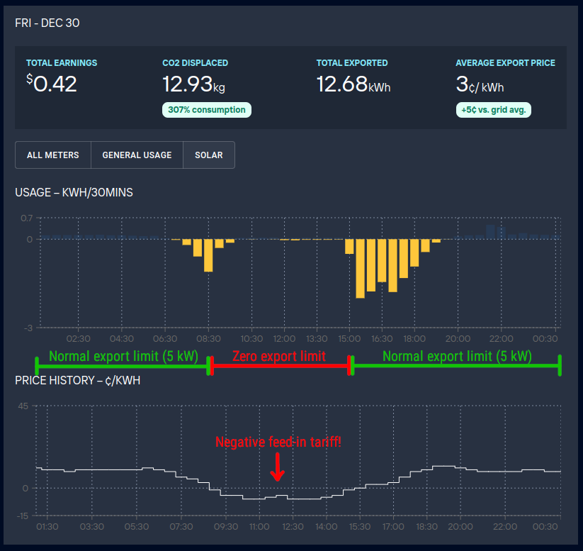
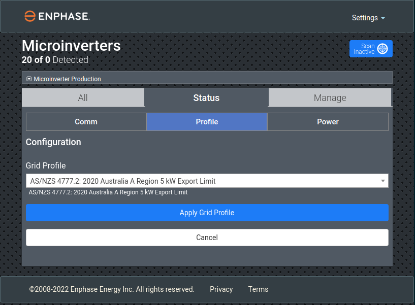
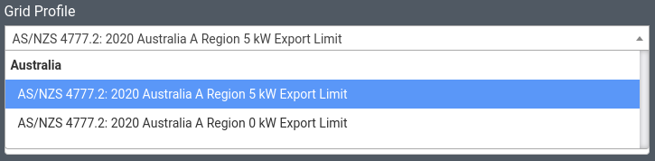
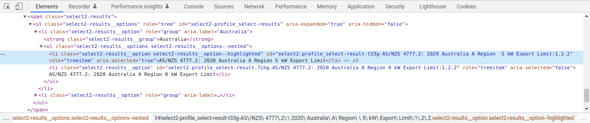
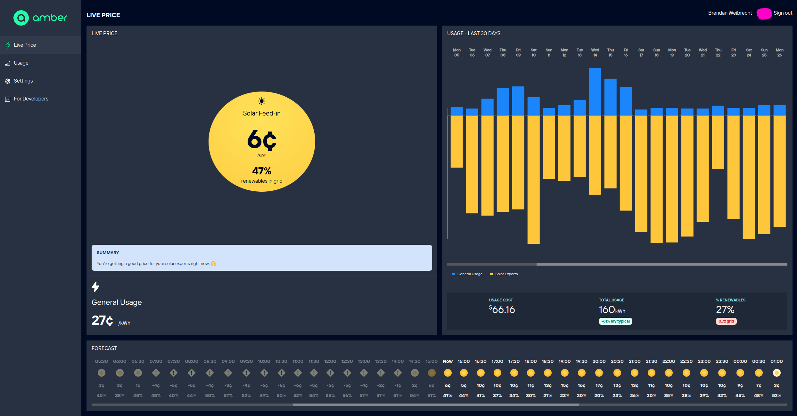
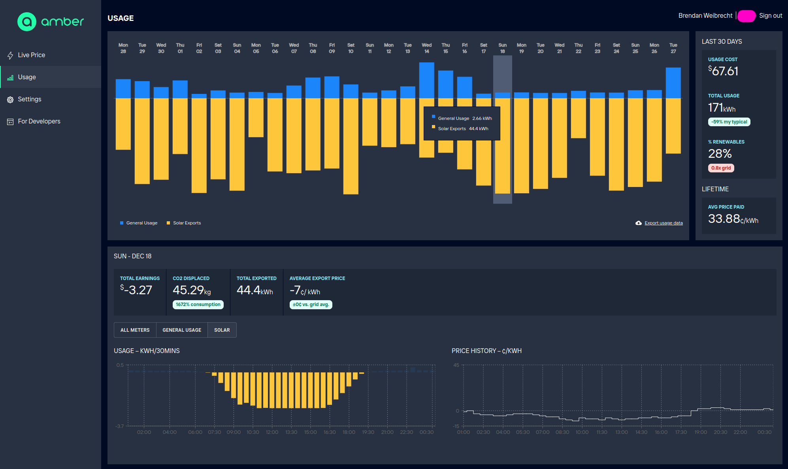
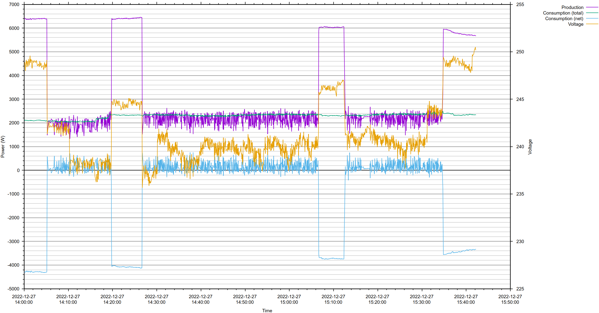
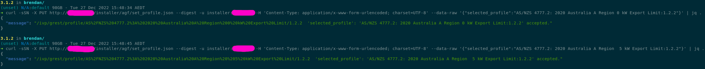
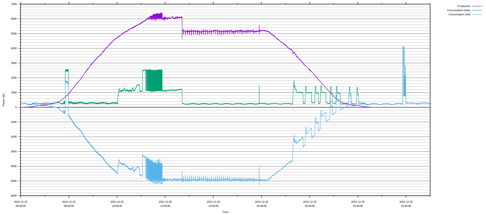

# Amber Enphase Zero Export Switcher Tool (Zest)


Zest is a small background program to automatically prevent your battery-less [Enphase](https://enphase.com/) solar system from exporting energy to the grid while your [Amber Electric](https://www.amber.com.au/) solar feed-in tariff is negative. This avoids the disappointment of [being charged money](doc/images/amber-negative-prices-worst-day.png) due to your solar system exporting energy to the grid at a bad time!

Example of the effect on a day where the feed-in price went negative:



## Contents

<!-- MarkdownTOC autolink=true -->

- [How it works](#how-it-works)
- [Amber referral code](#amber-referral-code)
- [Setup](#setup)
    - [System requirements](#system-requirements)
    - [Dependencies](#dependencies)
    - [Configuration](#configuration)
        - [Amber token](#amber-token)
        - [Amber site ID](#amber-site-id)
        - [Installer access on Envoy firmware V4/V5 - Envoy installer password](#installer-access-on-envoy-firmware-v4v5---envoy-installer-password)
        - [Installer access on Envoy firmware V7 - Enlighten self-installer account](#installer-access-on-envoy-firmware-v7---enlighten-self-installer-account)
        - [Grid profile names](#grid-profile-names)
        - [Custom command to run after switching grid profile](#custom-command-to-run-after-switching-grid-profile)
        - [Envoy access token \(for telemetry\)](#envoy-access-token-for-telemetry)
- [Run the program](#run-the-program)
- [Screenshots](#screenshots)
- [Install on Linux as a systemd service](#install-on-linux-as-a-systemd-service)
- [Status file](#status-file)
- [Collect and graph power telemetry from Envoy](#collect-and-graph-power-telemetry-from-envoy)
- [Contributing](#contributing)
- [Development](#development)

<!-- /MarkdownTOC -->

## How it works

Enphase devices are configured with a 'Grid Profile', which encompasses a whole lot of power parameters - including a limit of how much power you are permitted to export to the grid. As an example, I have an 8.2kW solar system, but in my area, the power distribution company (responsible for the power poles and wires), Jemena, impose a 5kW export limit. What this means is that even if there is enough sunshine to generate the full 8.2kW, if the power consumption of my home is not high enough, the system limits its generation capacity so that it never exports more than 5kW to the grid. It is this capability that can be utilised, to set the grid export limit to 0.

With such an amount of energy 'going to waste', I could be better off to buy a battery to store it in and use later. Also, the 'self-consumption' mode - which I think is the battery equivalent of what I'm trying to achieve - is better supported with a battery. But for financial reasons, it's not on my agenda to buy a battery. I do plan to instead eventually buy an EV and smart charger which can serve as a home battery; but that is quite some time away. So this program will be rather handy in the meantime.

The Envoy has a web server accessible on LAN, by pointing a web browser at its IP address. The homepage is not password-protected, but other pages are. Some require the homeowner credentials, and some are intended for use by the system installer. On one of the installer pages, there is a select box where you can choose the grid profile to use. Originally, I only had one grid profile available - the 5kW export limit one - but thankfully, I was able to easily get Enphase to add a 0kW export limit one. Now it is just a matter of changing the selected profile. And that can be done programmatically by this program.

The program polls the Amber API for your feed-in price, and when it crosses the $0 threshold, the appropriate grid profile is applied.

## Amber referral code

If you're not an Amber Electric customer yet, here's my referral link: https://mates.amber.com.au/HF5AT3KH

Use that to sign up, and we both get $30! 🎉

## Setup

### System requirements

This may work with different Enphase systems, but here's what I have:

- Gateway
    + Enphase Envoy-S-Metered-EU
        * SKU: ENV-S-WM-230
        * **Software version: D7.6.175 (f79c8d)**
        * **Software version: D5.0.55 (4f2662)** (prior to 2023-07-07)
- Microinverters
    + Enphase IQ7A
        * SKU: IQ7A-72-2-INT
- A computer to run this on, which can remain:
    + Connected to the local network
    + Running during daylight hours at least

It's also reportedly working on **Software version: R4.10.35 (6ed292)**.

### Dependencies

- [Install Ruby](https://www.ruby-lang.org/en/downloads/) (needs 3.1+)
- [Download the contents of this repository](https://github.com/ZimbiX/amber-enphase-zero-export-switcher-tool/archive/refs/heads/master.zip)
- Install the gems using Bundler:
    + Open a terminal within the program's folder and run `bundle`

### Configuration

Create a file called `.env` containing the following:

```
ZEST_LOG_LEVEL=debug
ZEST_STATUS_FILE=.status
ZEST_COMMAND_TO_RUN_AFTER_SWITCHING_GRID_PROFILE=

ZEST_AMBER_TOKEN=[your token from Amber]
ZEST_AMBER_SITE_ID=[your site ID from Amber]
ZEST_AMBER_POLL_INTERVAL_SECONDS=10

ZEST_ENPHASE_ENVOY_IP=[IP address of your Envoy]

ZEST_ENPHASE_ENVOY_FIRMWARE_VERSION=7

# For firmware v4/v5:
ZEST_ENPHASE_ENVOY_INSTALLER_USERNAME=installer
ZEST_ENPHASE_ENVOY_INSTALLER_PASSWORD=[your installer password]

# For firmware v7:
ZEST_ENPHASE_ENVOY_SERIAL=[serial of your Envoy]
ZEST_ENPHASE_ENLIGHTEN_USERNAME=[your username for Enlighten with self-installer permission]
ZEST_ENPHASE_ENLIGHTEN_PASSWORD=[your password for Enlighten with self-installer permission]

ZEST_ENPHASE_ENVOY_GRID_PROFILE_NAME_NORMAL_EXPORT="[your normal grid profile name]"
ZEST_ENPHASE_ENVOY_GRID_PROFILE_NAME_ZERO_EXPORT="[your zero-export grid profile name]"

# For telemetry on firmware v7:
ZEST_ENPHASE_ENVOY_ACCESS_TOKEN=[a user token]
```

#### Amber token

You can generate an Amber token on the 'For Developers' page: https://app.amber.com.au/developers. Enable 'Developer Mode' in the 'Settings' page to gain access to this. When asked for a name for the token, you can enter something like 'Amber Enphase Zero Export Switcher Tool'.

#### Amber site ID

To find your Amber site ID:

- Go to Amber's 'For Developers' page
- Click the 'Authorize' button at top-right
- Paste your token in the box and click 'Authorize' then 'Close'
- Expand the `GET /sites` section
- Click 'Try it out'
- Click 'Execute'
- Under the 'Server Response' heading, you should now see a response body containing an ID field. Note that this is distinct from the example response body just below

#### Installer access on Envoy firmware V4/V5 - Envoy installer password

On Envoy firmware V4/V5, installer access is simple to acquire.

The default installer password can be algorithmically generated from the Envoy's serial number. I am very grateful for the prior work done by others to figure this out. To generate it, there are a few options:

- [An Android app by thecomputerperson](https://thecomputerperson.wordpress.com/2016/08/28/reverse-engineering-the-enphase-installer-toolkit/)
- [A Python script by Markus Fritze](https://github.com/sarnau/EnphaseEnergy)
- [A webpage by Tristan Mott](https://blahnana.com/passwordcalc.html) (easiest)

Not that you need it for our configuration, but FYI, the credentials for the homeowner pages are: `envoy` / \[the last six digits of the Envoy serial... which is displayed on the unauthenticated homepage\]

#### Installer access on Envoy firmware V7 - Enlighten self-installer account

On Envoy firmware V7, installer access requires intervention from Enphase.

[Firmware version 7 changes the method of authentication](https://support.enphase.com/s/question/0D53m00006ySLuRCAW/unimpressed-with-loss-of-local-api-connectivity-to-envoys?t=1672164431932) to using a [token that has to be refreshed through a UI](https://enphase.com/download/iq-gateway-access-using-token-tech-brief). A user token lasts six months, and an installer token lasts 12 hours. Zest automates acquiring and refreshing an installer token.

You'll need to email Enphase support and ask that DIY installer access be added to your account.

#### Grid profile names

You can find these at: `http://your-envoy-ip/installer/setup/home#microinverters/status/profile`. Note that if you go to that URL directly, you'll be redirected to another page; just enter the URL again and it will then take you to the right one:



The dropdown shows what profiles you have available, e.g.:



Note that it seems grid profiles have a real name and a display name. In my case, they are practically identical, but for an additional space in the 5kW one's real name. As an example, the real names of my grid profiles are:

- `AS/NZS 4777.2: 2020 Australia A Region  5 kW Export Limit:1.2.2`
- `AS/NZS 4777.2: 2020 Australia A Region 0 kW Export Limit:1.2.2`

You need the real name of each. This can be found with the inspector in Chrome: Right-click on one of the items in the dropdown -> Inspect.

Some HTML code will appear, with one line highlighted, e.g.:



Double-click on the profile name that's next to `id=` and copy it, e.g. `select2-profile_select-result-t33g-AS/NZS 4777.2: 2020 Australia A Region  5 kW Export Limit:1.2.2`. Trim `select2-profile_select-result-t33g-` or similar from the start, and you now have your real profile name, e.g. `AS/NZS 4777.2: 2020 Australia A Region  5 kW Export Limit:1.2.2`.

If you don't have a zero export grid profile selectable, contact Enphase or maybe your installer to request that they add one for you. I sent Enphase a message, and impressively, they'd added a copy of my grid profile with zero export within an hour.

#### Custom command to run after switching grid profile

You may need to perform another action after Zest switches the Envoy's grid profile, e.g., for [compatibility with a battery, changing its reserve power level so it doesn't conflict with the Envoy's zero export limit](https://github.com/ZimbiX/amber-enphase-zero-export-switcher-tool/issues/1) (shutting down solar production and running the house off the battery). For this reason, support is provided for running a custom script post-grid-profile-switch. Set the command in `ZEST_COMMAND_TO_RUN_AFTER_SWITCHING_GRID_PROFILE` in your `.env` file, e.g.:

```
ZEST_COMMAND_TO_RUN_AFTER_SWITCHING_GRID_PROFILE="/path/to/my/script.sh"
```

Your script can read the [status file](#status-file) to see what mode the Envoy's export limit is now set to.

Note that the command is run synchronously - Zest will not continue until your script finishes.

#### Envoy access token (for telemetry)

- Browse to: https://entrez.enphaseenergy.com
- Log in with your Enphase credentials
- In the 'Create access token' form, search for your system by typing at least three characters of your system name into the 'Select System' field. I imagine this corresponds to the name in Enlighten shown at: Menu -> System -> Site Details. In my case the system name was 'Brendan Weibrecht'
- Click the suggestion in the dropdown: '[site name] - [site ID]'
- Select the gateway from its now-populated dropdown
- Click 'Create access token'

## Run the program

To start the program, open a terminal in the program's folder and run:

```
ruby zest.rb
```

and let it go!

```
I -- Amber says exporting energy to the grid would currently earn me: 2.87317 c/kWh
I -- Making HTTP request to set export limit to normal...
I -- Request complete

I -- Amber says exporting energy to the grid would currently earn me: 2.9334 c/kWh
I -- Export limit is already set to normal

I -- Amber says exporting energy to the grid would currently earn me: 2.9334 c/kWh
I -- Export limit is already set to normal
```

## Screenshots

Here's an example of the kind of negative feed-in prices I'm trying to avoid:



Which can result in days like this:



Realtime sampled telemetry showing the effects of my profile switching experimentation:



Running a cURL command to switch grid profile:



## Install on Linux as a systemd service

If your computer is running a systemd-based Linux, and you've installed Ruby with rbenv, here's how to have the program start automatically on boot:

- Clone the directory somewhere and enter it:

    ```bash
    git clone git@github.com:ZimbiX/amber-enphase-zero-export-switcher-tool.git
    cd amber-enphase-zero-export-switcher-tool
    ```
- Add configuration in `.env`
- Run the install script to add and start the `zest` systemd service:

    ```bash
    ./scripts/install
    ```

    This can be re-run after a `git pull` to update the installation.

To see logs:

```
journalctl --user -u zest
```

## Status file

The current export limit status is written to the file path configured in `ZEST_STATUS_FILE` - the file content being either `normal` or `zero`.

This is to aid displaying this information in other tools.

## Collect and graph power telemetry from Envoy

I should get Home Assistant and Grafana set up at some point, but I've been using a gnuplot-based system for a while and thought I might as well share it.

To start collecting telemetry, run:

```bash
./telemetry/envoy-telemetry-collector.sh
```

Or peform the above systemd service installation with `./scripts/install --telemetry` to also install a service for the telemetry collection script.

Telemetry will be collected to `~/envoy.csv`. Note that this collects instantaneous power readings (W), so the data cannot accurately be used to calculate energy (Wh).

To graph recent telemetry, install [gnuplot](http://www.gnuplot.info/) and see the comments at the top of the [gnuplot script](telemetry/envoy.gnuplot) for its usage.

Example:



## Contributing

This is a tiny app, but you are welcome to contribute. File an issue on GitHub if you encounter a bug. Feel free to discuss a feature prior to development by filing an issue. PRs more than welcome.

## Development

Once you've followed the setup instructions, to run the tests:

```bash
bundle exec rspec -fd
```

To debug HTTP issues, [set the `HTTPX_DEBUG` environment variable](https://honeyryderchuck.gitlab.io/httpx/wiki/Debugging).
